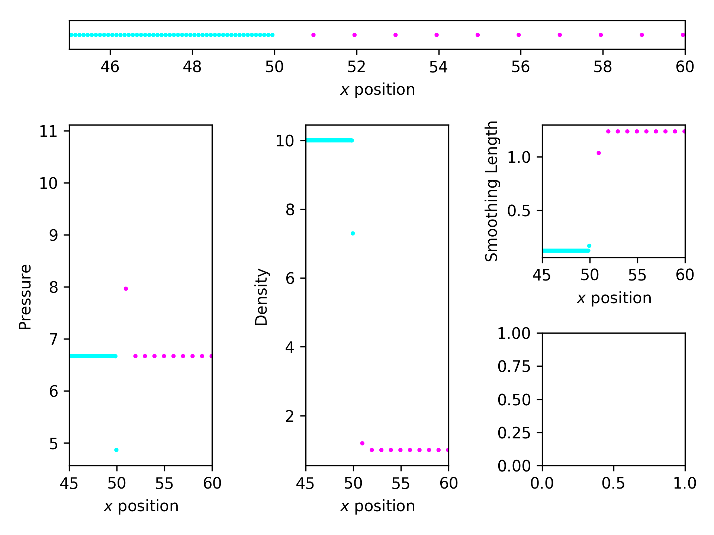
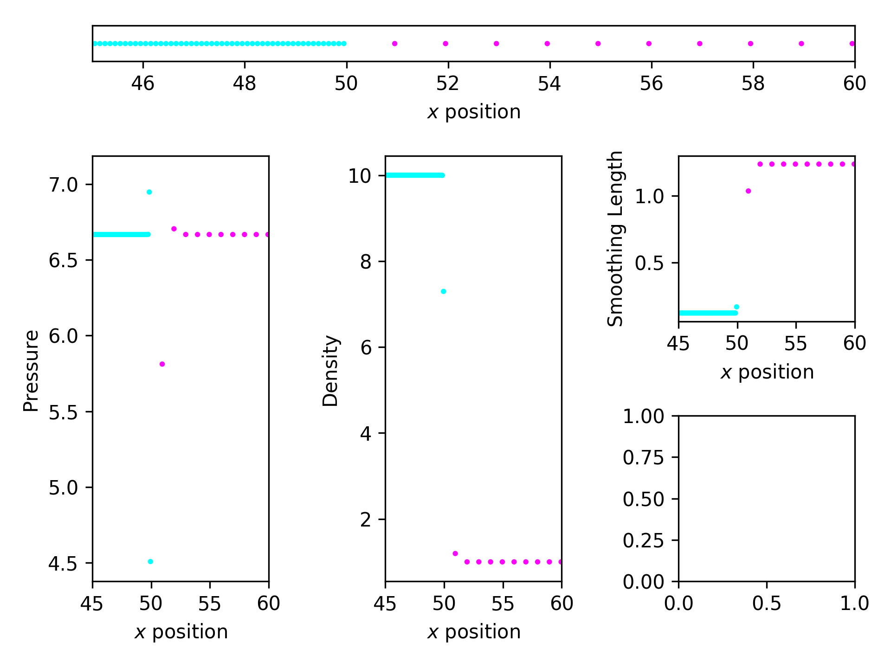
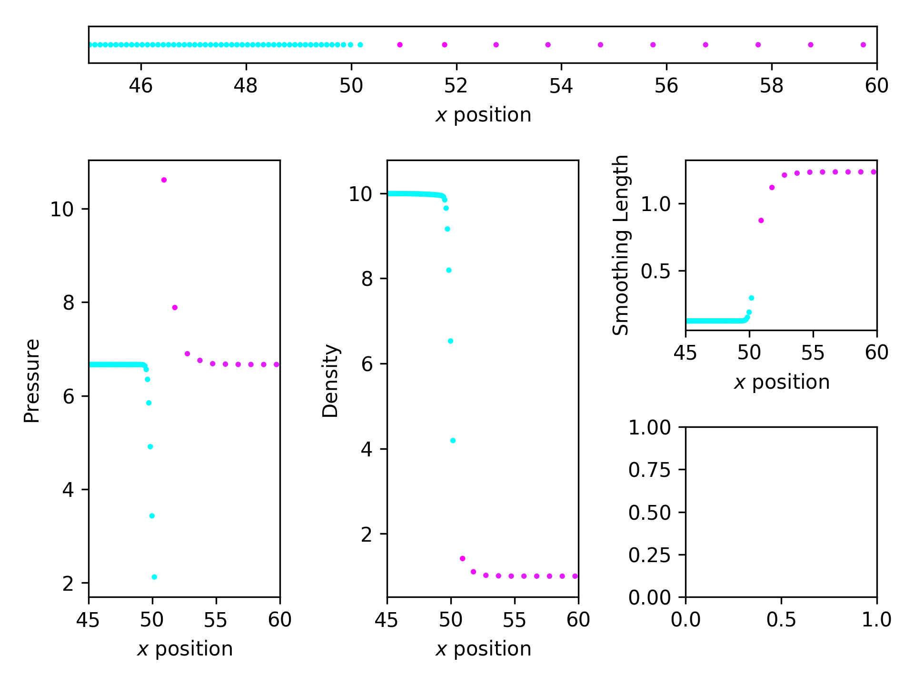
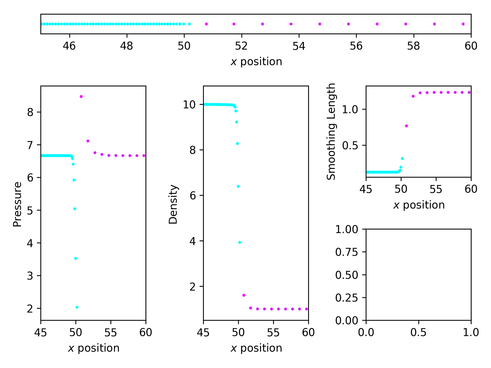

SPH Tests in 1D
===============

A quick example of an SPH test in 1D. We use `swift` as a submodule to
actually run our test problems rather than  having to concern ourselves with
writing our own (slower) SPH code.

There are several configuration options that you can tweak. There are of course
the SWIFT configuration options that are available in `parameter_file.yml`, but
the initial condition generator and plotting script are controlled by the
`config.yml` file.

### Requirements

+ `python3`
+ `h5py`, `numpy`, `pyyaml`, `pytest` (for the tests) and `matplotlib`. Use 
   `pip install -r requirements.txt`.
+ `swift`'s requirements, i.e. `hdf5>=1.8.0`, `fftw3`.

### Running the problem

To run this, do the following:

+ Ensure the `swiftsim` submodule is loaded/cloned
  (i.e. run `git submodule update --init --recursive`)
+ `./run.sh` and wait.

`run.sh` sets all of the correct configuration parameters for SWIFT, generates
the initial conditions, makes and runs SWIFT, and then creates plots that it
saves in `./plots`. At the moment the plots are a bit 'rough and ready', but
seeing as the purpose of this is to test the convergence between PE and TSPH,
here are the plots from the initial conditions:

### GADGET ICs

### Pressure Entropy ICs

and after convergence:

### GADGET After Convergence

### Pressure Entropy After Convergence

